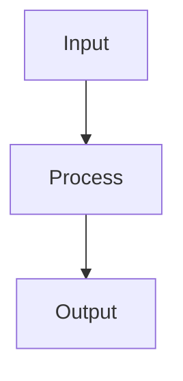
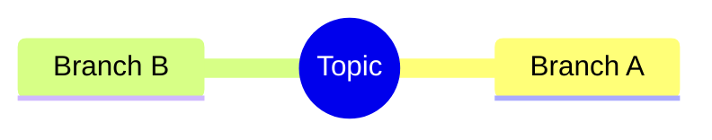
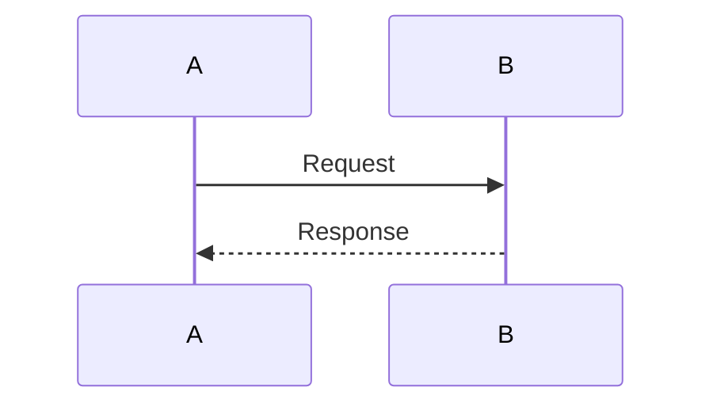

# Mermaid Rules - Clean Conceptual Maps

Formatting instructions for Mermaid.js diagrams. Keep raw, minimal, monospace-aligned.

## Core Principles

- **MAX 3 WORDS per node** — Prevents layout sprawl
- **Clean syntax** — No decorators, no complex styling
- **Monospace-compatible** — Works with raw rendering

## Allowed Diagram Types

### Flowchart


### Mind Map


### Sequence


### State Diagram
```mermaid
state-v2
    [*] --> Idle
    Idle --> Processing
    Processing --> Done
```

## Node Text Limits

| Type | Max Words | Example |
|------|-----------|---------|
| graph TD | 3 | "User Input" |
| mindmap | 2 | "Main Idea" |
| sequence | 4 | "Send Request" |
| state | 2 | "Idle" |

## Style Restrictions

- NO rounded boxes (`:::`, `rounded`)
- NO gradients or fill colors
- NO custom fonts in mermaid
- NO complex subgraph decorations
- Default stroke only

## Syntax Templates

### Simple Flow
```
graph LR
    A[Start] --> B{Decision}
    B -->|Yes| C[Action]
    B -->|No| D[End]
```

### Tree Structure
```
graph TB
    A[Root] --> B[Child 1]
    A --> C[Child 2]
    B --> D[Leaf 1]
    B --> E[Leaf 2]
```

### Parallel Tasks
```
graph LR
    A[Task] -->|Sub1| B[Branch 1]
    A -->|Sub2| C[Branch 2]
    B --> D[Merge]
    C --> D
```

## Anti-Patterns (Avoid)

- Long labels spanning lines
- Nested subgraphs with titles
- Custom CSS in mermaid blocks
- Complex arrow styles (dashed, dotted)
- Multiple entry points
- Circular references without termination

## Rendering Notes

- Mermaid renders in HTML via `mermaid.js` CDN
- For Reveal.js: use `.mermaid` code blocks
- For standalone HTML: include mermaid JS lib

## Quick Reference Card

```
MAX WORDS: 3
GRAPH STYLE: flat stroke only
ARROWS: --> or --- (no labels unless essential)
LABELS: [Text] for boxes, (Text) for diamonds
```